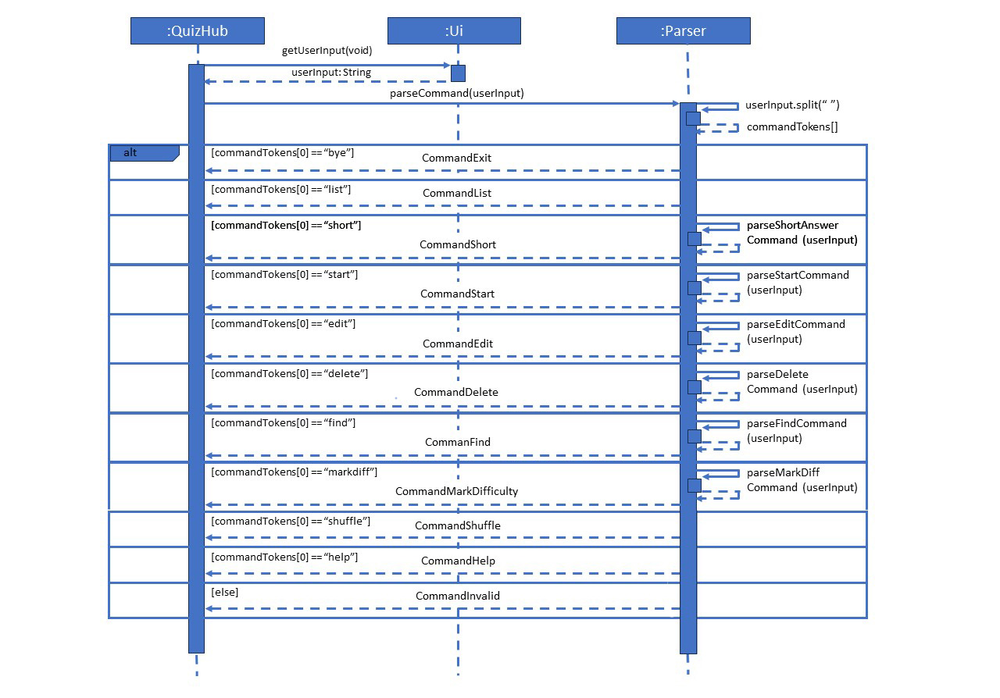
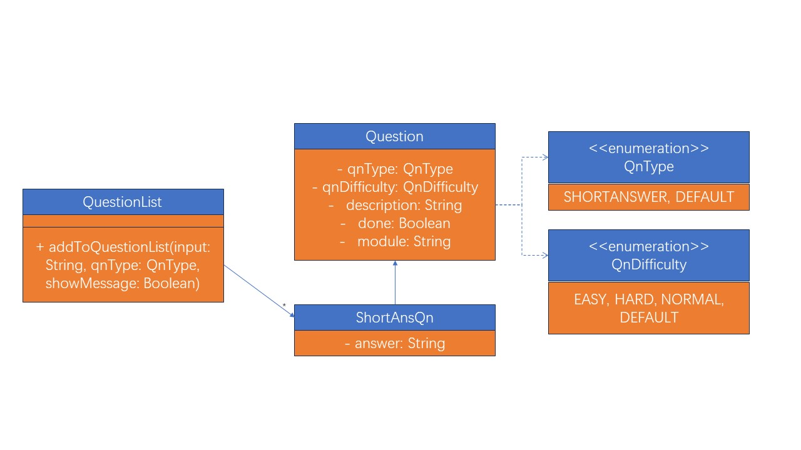
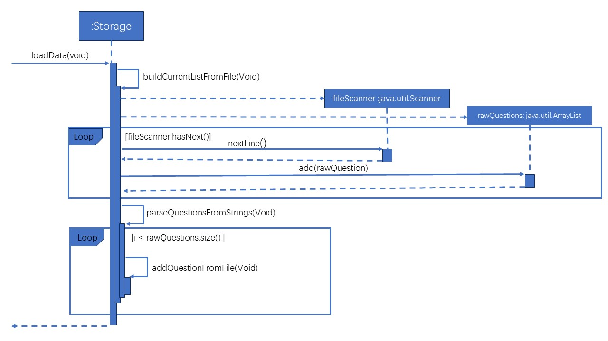
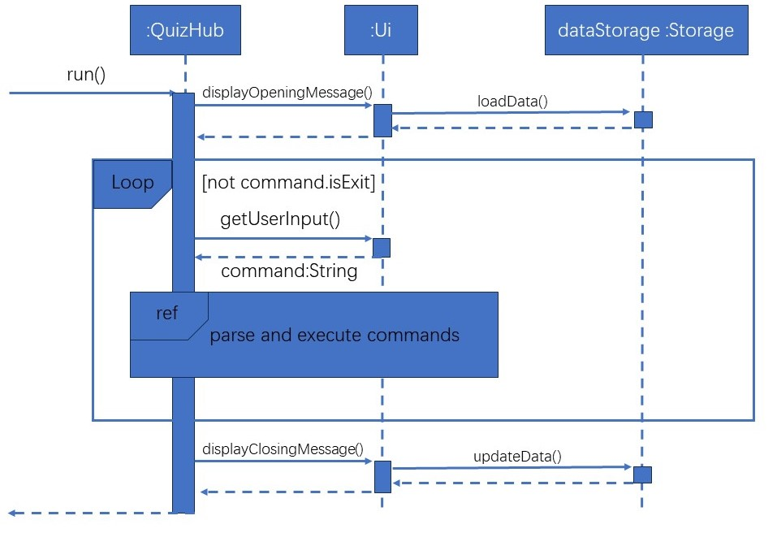
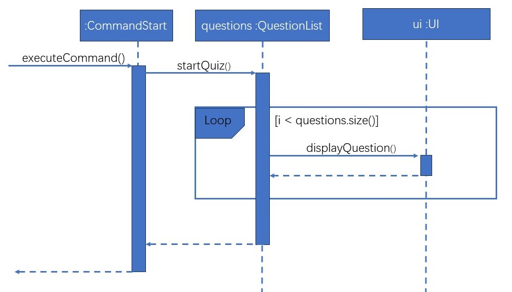

# Developer Guide

## Table of Contents
* [Acknowledgements](#acknowledgements)
* [Design and Implementation](#design--implementation)
  * [Application Lifecycle](#application-lifecycle)
  * [Parser Component](#parser-component)
  * [Command Component](#command-components)
  * [Storage Component](#storage-component)
  * [UI Component](#ui-component)
* [Product Scope](#product-scope)
* [Non Functional Requirements](#non-functional-requirements)
* [Glossary](#glossary)
* [Instructions for Manual Testing](#instructions-for-manual-testing)

## Acknowledgements

1. For the main structure of the program, we have adapted the project structure
<<<<<<< HEAD
from the Individual Project of Man Juncheng at [Link](https://github.com/spinoandraptos/ip/tree/master) </li>
2. For JUnit testing, we have adapted the testing codes from the AddressBook level-2
codes at [Link](https://github.com/se-edu/addressbook-level2)</li>
3. For the developer's guide, we have referenced the developer's guide from AddressBook
level-3 [Link](https://se-education.org/addressbook-level3/DeveloperGuide.html)
=======
   from the Individual Project of Man Juncheng at [Link](https://github.com/spinoandraptos/ip/tree/master) </li>
2. For JUnit testing, we have adapted the testing codes from the AddressBook level-2
   codes at [Link](https://github.com/se-edu/addressbook-level2)</li>
3. For the developer's guide, we have referenced the developer's guide from AddressBook
   level-3 [Link](https://se-education.org/addressbook-level3/DeveloperGuide.html)
>>>>>>> user-guide

# Design & implementation

## Overall Architecture
The main execution of the QuizHub application will concern 4 components which
are the QuizHub, Ui, Parser and Command packages.


`Quizhub` is the "main" class, which is responsible for starting the program,
initialising all other objects, executing commands, and shutting down.

`UI` is the component that interacts with the user, taking inputs and displaying
the results of the executed commands.

`Parser` acts as a multiplexer to determine which command to run, and what parameters
it has, based on the user input.

`Commands` refer to a package of individual commands with complex and specific
logic, which is later executed in Quizhub and displayed by `UI`.

`Storage` is the class through which questions can be stored on the hard drive and `Utility Classes`
refer to any miscellaneous utility classes used by all the components.

## Application Lifecycle


The program begins with the `run()` call to `QuizHub` class.

This starts a loop in which
user input is continuously read in from CLI for the user command to be extracted and executed.
In each iteration of the loop, `QuizHub` makes a call to `Ui.getUserInput()` and returns the
entire user input as a String object. Following which, `QuizHub` makes a call to
`Parser.parseCommand()` to extract the user command from the String object and returns a
`Command` object. Finally, `QuizHub` makes a call to `Command.executeCommand()` and performs
the requested task.

If `Command` is of Exit type, the loop will exit, and the program terminates.

## Parser Component

The `Parser` component is the backbone behind the program, functioning as the API
between the CLI user interface and the core functionalities of the program. It supports
the direct communication between the program and user by converting user input into `Command`
objects which can be interpreted by the program.

### Design Considerations

As the `Parser` functions as the API between user and program, it must be designed with a clear
consideration of both human and machine requirements.

Our target users are NUS students preparing for exams who wish to use our program to facilitate
their practice. Considering that time is of the essence for revising students, the `Parser` must
prioritise efficiency of use to not cause time delays to users' revision. With this in mind,
we based our design off the following points for inputs taken in by the `Parser`.

1. **Ease of use**: Simple and short command structure


2. **Ease of familiarisation**: No excessive or complicated commands

Consideration must also be given to the developers and machine executing the code. The exact
mechanism behind the `Parser` must be able to effectively extract the relevant information from
user inputs in a non-arbitrary way to be used by other classes. Hence, we also need to strike a balance with the
following point for inputs taken in by the `Parser`.

1. **Ease of processing and validation**: Hierarchical command structure

### Alternative Design Considerations

In designing the `Parser`, an alternative design we considered is to follow that of `Unix`
command interface. The `Unix` parser is designed such that input commands are required to
have the syntax of ```command -(options) argument1 argument2 ...``` where the order of arguments
does not matter. While this is a clean and neat parser design, we have decided not to adopt this
design as we see a strong need of having a hierarchical command structure for our program.

1. A hierarchical structure introduces logical sequence and flow to the command used,
   facilitating a quick familiarisation process for users to quickly learn the command syntax.
   This is in line with our design consideration to minimise learning and familiarisation time
   for users. This is in addition to the ease of processing and validation of commands.
   ```short [question]/[answer]/[module]/[difficulty]```, for one, is a command that has a
   logical sequence to which the details of a question is entered. It is more intuitive to
   follow a structure instead of entering such details without a fixed order, which can easily
   lead to confusion.


2. The use of the delimiter `/` also better helps to introduce the concept of hierarchy than the
   delimiter `--` used in `Unix` commands as `/` can be more easily associated with layering and
   stacking, which create structures possessing hierarchy.

### Parser Command Syntax

Our final design  seeks to optimise both user experience and program effectiveness.
We have hence chosen the following general syntax for commands to be input into the `Parser`.
All commands require a starting payload, but some commands do not require the subsequent arguments.

```
commandType [payload] [/argument1 [payload1] /argument2 [payload2] ... ]
```
The command structure is simple, short, and intuitive. With commands rarely requiring more
than 2 arguments, typing and inputting the command in CLI is fast and efficient, allowing
revising students to quickly utilise the program. The hierarchical and logical structure to
the arrangement of arguments and payloads allows students to quickly familiarise with the
syntax and minimise delays to their learning schedule.

The hierarchical structure also allows for the respective payload to be easily extracted
with little ambiguity. Command validation can then be performed sequentially, facilitating
efficient checks.

### Implementation

The main function of `Parser` is to decode user input and extract relevant information to be
used by other classes. Hence, it supports 3 main methods as listed below.
1. `parseCommand`
2. `getContentAfterKeyword`
3. `extractQuestionDifficulty`

`parseCommand`

This method processes raw user input from CLI to extract information to be assembled into a
`Command` object. It determines the type of command by reading the commandType from the
very start of the user input.

The following sequence diagram shows the implementation of `parseCommand`.



`getContentAfterKeyword`

This method acts as a helper method to assist in extracting the payload following an argument
in the user input. It is used in the constructing of `Command` objects when command-specific
information need to be extracted from arguments in the user input.

It simply breaks up an entire ```/argument [payload]``` String into ```/argument``` and
```[payload]``` and returns the `[payload]`. Hence, any String passed into this method must
take on the form of ```/argument [payload]``` or an exception will be thrown and handled by
printing an error message to the CLI.

`extractQuestionDifficulty`

This method acts as a helper method for extracting an `QnDifficulty` enum type from a user
text input. This is used for setting question difficulty during the construction of a
`Question` , or the execution of a `CommandMarkDifficulty`.

If the string passed to this method does not describe an existing question difficulty level, an
exception will be thrown and handled by printing an error message to the CLI.

## Command Components


### Start Command - Start Quiz

The start quiz feature allows users to start quizzing themselves with customizable characters to define which modules to quiz themselves on alongside whether to randomize the questions or use their pre-defined question order.


The start quiz mechanism is facilitated by CommandStart under package quizhub.command. The class utilises methods from `quizhub.questionlist.QuestionList`.  It extends Command with 2 new prompts (`/[quiz mode]` and `/[qn mode]`) and 1 user input field (`/[start details]`). It implements the following operations:

`/[quiz mode]`
1. 2 configurations - `/module` and `/all`
2.	`/module` must be followed by a category name to retrieve questions from that specific category
- The method categoriseListByModules from the package `quizhub.questionlist.QuestionList` will be called to retrieve the questions by that are listed within the specified category from the storage list
- `/all` will not require any input from `/[start details]`
3.	The method `getAllQns()` from package `quizhub.questionlist.QuestionList` will be called to retrieve all questions from the storage list.

`/[qn mode]`
1.	2 configurations - `/random` and `/normal`
2.	This prompt is activated after defining `/[quiz mode]` and `/[start details]`
3.	/random will randomize the list of questions using `java.util.Collections.shuffle` and store it within a temporary array to prevent tempering with the original array in Storage
4.	`/normal` will not require any further actions, using the previously generated list as specified by `/[quiz mode]` and `/[start details]`

`/[start details]`
1.	Define the category of `/module` i.e. `/module` number to call upon the “number” tagged modules when starting the quiz
2.	This field can be left blank when `/all` is called for `/[quiz mode]` to tell the program to quiz the user on all questions stored within the local storage

Thereafter the quiz is started by calling the method `startQuiz()` in package `quizhub.questionlist.QuestionList`. Within `startQuiz()`, the program iterates through the list of totalQuestions while blocking out the answers. The user can input their answer in the input field which is utilized to match with the actual answer to provide “correct” or “wrong”. Each correct answer will increment correctAnswers variable by 1. The quiz ends when all the questions are displayed and the total number of correctAnswers will be displayed.

### Short Command - Add Short Answer Question to the Quiz

One of the supported question formats is the Short Answer Question, in which a question
can be answered with a phrase of a few words, which will be matched to a corresponding answer
of sufficient similarity.

It is parsed as: `short [question]/[answer]/[module]/[difficulty]`
1. `[question]` is the question, phrased as asking the user (i.e. What is 2 + 2? )
2. `[answer]` is the answer or possible answer(s) that the user must
   input to count as correct. It is case-insensitive. (i.e. 4, four)
3. `[module]` is the module that the question belongs in (i.e. CS2113)
4. `[difficulty]` is the difficulty of the question for sorting later (i.e. Hard)

*Condensed Class Diagram - Does not contain all attributes & methods


Thereafter, the command is returned to the Quizhub component and executed,
to add a Question object to the corresponding QuestionList object
using the `addToQuestionList` method. This method will analyse the arguments above
and add the Question to the appropriate list.

### Find Command  - Look for a matching question

Quizhub supports searching for specific questions, by searching matching keywords
in the format

`find /[description]` OR `find /[module]`
i.e. `find /CS2113`, `find /water buffalo`

This command is passed to the corresponding QuestionList where the `searchList` method
is called, which will create a new ArrayList of questions that contain the (case-insensitive)
keyword and subsequently print them.

## Storage Component

The Storage class is a critical component of the QuizHub application, responsible for managing the storage, retrieval, and updating of question data. It represents a hard disk storage system for storing, reading, and updating question data. It interacts with question data in a file specified by the user and integrates with the `QuestionList` class for effective storage and retrieval of questions.

Developers need to be aware of the two main methods for loading and updating data:

- `public void loadData(QuestionList questions)`
- `public void updateData(QuestionList questions)`

The details of the data loading and updating process are explained in details below.

### Constructor

#### `public Storage(String filePath)`

- **Parameters:**
  - `filePath`: The path to the file where question data is stored and read from.

### Loading data

The process of loading data from the storage file specified in the constructor takes places in a few steps. To illustrate the overall flow on loading data, refer to the sequence diagram below.



:exclamation: This sequence diagram emphasizes the process of loading data into storage, and has therefore omitted details of more trivial and/or non-related methods as well as exception handling logic. To find out more about the details, please refer to the complete code and header comments.

In addition to the main `loadData` method, the process involves the following 3 helper methods:
- `private void addQuestionFromFile(QuestionList questions, String currentQuestion, int questionIndex, String questionType, String questionDescription, String questionDoneStatus, String questionDifficulty, String questionModule)`
- `private void parseQuestionsFromStrings(ArrayList<String> rawQuestions, QuestionList questions)`
- `public void buildCurrentListFromFile(QuestionList questions)`

The general idea is that when the program is first initiated, the `loadData` method is called from within the `Ui` class, which passes in an empty `QuestionList`. Within the method itself, the helper method `buildCurrentListFromFile()` will take in this empty `QuestionList` object and populate it with `question` objects according to textual information stored within the specified file. This is done by first extracting each question stored line by line into a new `Arraylist<String> rawQuestions`, then calling another helper method `parseQuestionsFromStrings()` to add each question into the `QuestionList` via a third helper method `addQuestionFromFileaddQuestionFromFile`.

<<<<<<< HEAD
The process is refactored into these methods to avoid deep nesting of code to achieve clearer logical flow and more readability and easier debugging process. 
=======
The process is refactored into these methods to avoid deep nesting of code to achieve clearer logical flow and more readability and easier debugging process.
>>>>>>> user-guide

### Updating data

The process of updating data is done in a similar fashion compared to that of loading data, but in the reverse order logically.

Apart from the main `updateData` method, it involves the use of 2 other helper methods:
- `private void writeToFile(String filePath, String textToAdd, boolean toAppend)`
- `private void storeQuestionToFile(Question question)`

Upon exiting the program, the `Ui` class will call the `updateData` method and passing in the current `QuestionList` of the program. Within the method, the `writeToFile` helper method is first called to determine whether texts are to replace existing content of the file or to be appended at the back. Then, each question is stored in the appropriate format into the destination file using the method `storeQuestionToFile` which parses a `Question` object into the correct string format for storage.

## UI Component

The UI class in the Quizhub application is responsible for handling the user interface interactions in a command-line interface (CLI). It provides methods for displaying messages or questions as well as getting user
input.

### Constructor

#### `public Ui(Storage dataStorage, QuestionList tasks)`

- **Parameters:**
  - `dataStorage`: An instance of the `Storage` class, which handles the storage of quiz data on the hard disk.
  - `tasks`: An instance of the `QuestionList` class, which represents a record of all questions documented in the application.

### Implementation Details

#### Overall Flow



When the program is first initiated, the `displayOpeningMessage()` method is called to display a welcome message while also calling the `loadData()` method of the `dataStorage` to display all the questions stored in the storage file if any.

Afterward, in the main loop of the program execution, the `getUserInput()` method is called at the start of the loop to capture user input as a `String` object, which is then used by the `Parser` and various `Command` classes to parse and execute the appropriate commands. This process is terminated only upon execution of a `CommandExit`.

Finally, the `displayClosingMessage()` method is called to display a farewell message while also calling the `updateData()` method of the `dataStorage` to update the data stored in the storage file with the latest ones.

#### Displaying Quizzes



The `Ui` class also has a `displayQuestion(Question question, int currentQuestionIndex, int totalQuestions)` method, which is used to render a question from the list of stored questions in the specific format and prompt the user for an answer when a `CommandStart` is executed to signal the start of a quiz. This method will be called in a loop for each question until the end of the list of questions.

# Product scope

## Our Product
QuizHub

## Target user profile

Our target users are
* NUS Students preparing for exams
* Like to take notes in class
* Fear to miss out of important knowledge
* Like to test their understanding of knowledge
* Want to be better prepared for exams
* Majoring in computing or engineering where there are lots of exams
* Coders and tech geeks who enjoy using the CLI interface

## Value proposition

Allow NUS Students to easily take notes in class and allow them to
generate quizzes to test their knowledge of understanding. By using the
QuizHub application, students can input notes taken in class in a question form,
which they could use to take quizzes to ensure their understanding of the topic.

## User Stories

| Version |                As a ...               |                                   I want to ...                                   |                             So that I can ...                             |
|:-------:|:-------------------------------------:|:---------------------------------------------------------------------------------:|:-------------------------------------------------------------------------:|
| v1.0    | New student user                      | I can access the tutorial on how to operate the app                               | Easily use the app effectively for my studies                             |
| v1.0    | Efficient student                     | I can add a question and its answer easily to my question and answer bank         | Build my question and answer bank quickly                                 |
| v1.0    | Organized student                     | I can view all the questions and answers in my question and answer bank           | Review my study materials comprehensively                                 |
| v1.0    | Detail-oriented student               | I can edit the content of a question or its answer                                | Correct any mistakes or make improvements                                 |
| v1.0    | Student focused on clarity            | I can delete a question and its answer from my question and answer bank           | Maintain a clean and relevant set of questions for revision               |
| v1.0    | Student focused on revising for tests | I can start and end a quiz which tests me on questions in my question bank        | Consolidate understanding of my learnt knowledge through rigorous testing |
| v1.0    | Student focused on revising for tests | I can see my final quiz score and whether I have answered each question correctly | Identify areas of weakness to be improved upon for my tests               |
| v2.0    | User seeking efficiency               | I can search for a specific question within a flashcard deck                      | locate information quickly.                                               |
| v2.0    | User with diverse interests           | I can categorize questions by topic or subject                                    | tailor my quizzes                                                         |
| v2.0    | User seeking variety                  | I can shuffle the order of questions in a flashcard deck                          | keep my quizzes engaging.                                                 |
| v2.0    | User aiming for improvement           | I can mark a question as "difficult" or "easy" for later review                   | optimize my learning.                                                     |
| v2.0    | User seeking a challenge              | I can practice questions in a random order                                        | test my knowledge comprehensively.                                        |
| v2.0    | User seeking structure                | I can practice questions in a sequential order                                    | follow a specific learning path.                                          |
| v2.1    | user aiming for accuracy              | I can see how many questions I've answered correctly                              | track my proficiency.                                                     |
| v2.1    | user tracking progress                | I can reset the progress of a specific flashcard deck                             | start fresh.                                                              |
| v2.1    | time-conscious user                   | I can set a timer for each flashcard question during practice                     | manage my study sessions effectively.                                     |
| v2.1    | goal-oriented user                    | I can view my overall progress and performance statistics                         | gauge my improvement.                                                     |
| v2.1    | user aiming for improvement           | I can see how many questions I've answered incorrectly                            | focus on weak areas.                                                      |
| v2.1    | user committed to learning            | I can review the questions I've answered incorrectly                              | reinforce my knowledge.                                                   |

## Non-Functional Requirements

1. Program should work on any typical OS as long as it has Java 11 installed and configured.
<<<<<<< HEAD
2. A user with average or above typing speed for regular English text (not program code) in the CLI should not 
experience any significant delays to their revision as compared to using a GUI program.
=======
2. A user with average or above typing speed for regular English text (not program code) in the CLI should not
   experience any significant delays to their revision as compared to using a GUI program.
>>>>>>> user-guide

## Glossary

1. **Typical OS**: Windows, Linux, Unix, macOS.
2. **CommandType**: The first word input in the CLI, indicates the type of instruction the program should execute.
<<<<<<< HEAD
`e.g. start, delete, short`
3. **Argument**: A parameter word identified by a leading `/`, arguments indicate the start of information
to be extracted from a command in addition to the command type.
4. **Payload**: A sequence of additional information immediately following the command type or arguments, they
provide information for executing complex instructions.
=======
   `e.g. start, delete, short`
3. **Argument**: A parameter word identified by a leading `/`, arguments indicate the start of information
   to be extracted from a command in addition to the command type.
4. **Payload**: A sequence of additional information immediately following the command type or arguments, they
   provide information for executing complex instructions.
>>>>>>> user-guide
5. **Hierarchical**: Possesses logical sequencing or order, such as in order of decreasing subsets or importance.

## Instructions for manual testing

### Launch

1. Ensure you have Java 11 or above installed in your Computer.
2. Download the latest `tp_version_1.0.jar` from [here](https://github.com/AY2324S1-CS2113-W12-1/tp/releases/download/Version_1_0/tp_version_1.0.jar).
3. Copy the file to the folder you want to use as the home folder for your QuizHub.
<<<<<<< HEAD
4. Open a command terminal, cd into the folder you put the `tp_version_1.0.jar` file in, and use the java -jar 
`tp_version_1.0.jar` command to run the application and launch the CLI.
=======
4. Open a command terminal, cd into the folder you put the `tp_version_1.0.jar` file in, and use the java -jar
   `tp_version_1.0.jar` command to run the application and launch the CLI.
>>>>>>> user-guide
